# MmuoKọ Studios: The Inverted Customer Gaming Revolution
## An OBINexus Company - Where Consciousness Meets Code

### The Trilogy Framework
- **Uche** (Wisdom): Game design philosophy and narrative depth
- **Eze** (Authority): Content governance and age-appropriate controls
- **Obi** (Heart): Player connection and emotional resonance

---

## Vision: Gaming From The Heart

MmuoKọ Studios implements the **Inverted Customer Model** - a revolutionary approach where traditional retail channels become discovery partners, not gatekeepers.

```
Traditional Gaming Model:
Studio → Publisher → Platform → Retailer → Player → 💔

MmuoKọ Inverted Model:
Player ❤️ ←→ Retailer ←→ Studio ←→ [PhantomID Verification]
         ↓
    Trust & Value Flow
```

---

## Integration with OBINexus Ecosystem

### Cross-Repository Connections

1. **[PhantomID](https://github.com/obinexus/phantomid)**: Provides zero-knowledge age verification for age-conscious gaming
   - Rust-based polyglot daemon ensures secure player identity
   - Orphan state management for parental controls

2. **[MmuoKọ Connect](https://github.com/obinexus/mmuko-connect)**: Social layer for community engagement
   - Tonal communication patterns for player interaction
   - Nsibidi protocol for in-game messaging

---

## Studio Divisions & Age-Conscious Development

### MmuoKọ Eternal Kids (Ages 3-12)
**PhantomID Integration**: PEGI 3/7 verification via ZKP
```rust
// PhantomID age verification
let age_proof = phantomid::verify_age_range(3..12)?;
game.enable_kids_mode(age_proof);
```

**Games in Development**:
- **"Obi's Heart Journey"**: Learn empathy through adventure
- **"Uche's Wisdom Quest"**: Educational puzzles with cultural themes
- **"Eze's Kingdom Builder"**: Strategic thinking for young minds

### MmuoKọ Eternal Youth (Ages 12-17)
**PhantomID Integration**: PEGI 12/16 dynamic verification
```rust
// Progressive content unlocking
let youth_tier = phantomid::verify_youth_tier(player_id)?;
match youth_tier {
    Tier::Early => game.load_pegi_12_content(),
    Tier::Late => game.load_pegi_16_content(),
}
```

**Games in Development**:
- **"Phantom Networks"**: Learn programming through gameplay
- **"Tonal Warriors"**: Cultural rhythm combat system
- **"The Inverted World"**: Economic simulation with real lessons

### MmuoKọ Core (Ages 18+)
**PhantomID Integration**: Full PEGI 18 access with consent verification
```rust
// Mature content with consciousness
let adult_verification = phantomid::verify_adult_with_consent()?;
game.unlock_full_narrative(adult_verification);
```

**Flagship Titles**:
- **"GORYN: The Quantum Coherence"**: Philosophical action-RPG
- **"RIFTIN: Fractured Timelines"**: Narrative-driven thriller
- **"PhantomID: The Game"**: Meta-game about identity and consciousness

---

## The Inverted Customer Model in Practice

### For GameStop/CEX Partners
```javascript
// MmuoKọ Connect Integration for Retailers
const retailerAPI = {
    discoverGames: async () => {
        // Games discovered through trusted curators
        return await mmuoko.getRecommendations();
    },
    
    verifyPurchase: async (gameId, playerId) => {
        // PhantomID ensures age-appropriate sales
        const ageVerified = await phantomid.verify(playerId);
        return mmuoko.authorizeRetailSale(gameId, ageVerified);
    },
    
    earnCommission: (sale) => {
        // Fair compensation for discovery service
        return sale.price * DISCOVERY_COMMISSION_RATE;
    }
};
```

### Trust Infrastructure

```mermaid
graph TD
    A[Player Trust] -->|Discovers| B[Retailer]
    B -->|Recommends| C[MmuoKọ Game]
    C -->|Verifies via| D[PhantomID]
    D -->|Ensures| E[Age-Appropriate Content]
    E -->|Builds| A
```



---

## Technical Implementation

### Game Engine Integration
```rust
use mmuko_engine::{ConsciousnessEngine, HeartbeatSystem};
use phantomid::IdentityVerification;
use mmuko_connect::TonalCommunication;

pub struct MmuokoGame {
    consciousness: ConsciousnessEngine,
    identity: PhantomID,
    social: MmuokoConnect,
}

impl MmuokoGame {
    pub fn initialize() -> Result<Self> {
        let game = Self {
            consciousness: ConsciousnessEngine::new_with_heart(),
            identity: PhantomID::connect_polyglot()?,
            social: MmuokoConnect::establish_tonal_layer()?,
        };
        
        // Trilogy activation
        game.activate_uche_wisdom()?;
        game.invoke_eze_authority()?;
        game.connect_obi_heart()?;
        
        Ok(game)
    }
}
```

---

## Parent Portal Integration

### Real-Time Monitoring via PhantomID
```typescript
interface ParentPortal {
    // Connected via PhantomID family tree
    viewChildActivity(): Promise<ActivityLog>;
    
    // MmuoKọ Connect tonal analysis
    checkEmotionalState(): TonalReading;
    
    // Content control with Eze authority
    setContentLimits(limits: ParentalControls): void;
    
    // Uche wisdom insights
    getEducationalProgress(): LearningMetrics;
}
```

---

## Development Philosophy

### Witnessed Growth Principle
Even mature content is designed knowing:
- Parents may observe gameplay
- Cultural context matters
- Growth should be organic, not forced
- Safety through conscious design

### The Heart-First Approach
```python
class GameDesignPrinciples:
    def __init__(self):
        self.obi = "Every game starts from the heart"
        self.uche = "Wisdom guides narrative choices"
        self.eze = "Authority protects player wellbeing"
    
    def create_game(self, concept):
        if not self.comes_from_heart(concept):
            raise ValueError("#SorryNotSorry - No heart, no game")
        
        return Game(
            narrative=self.apply_uche_wisdom(concept),
            governance=self.establish_eze_protection(concept),
            connection=self.build_obi_bridges(concept)
        )
```

---

## Retail Partnership Program

### Benefits for Partners
1. **Discovery Rewards**: Commission on every sale
2. **Trust Building**: Become trusted game curators
3. **Community Growth**: Build lasting customer relationships
4. **PhantomID Integration**: Secure age verification system

### Implementation
```bash
# Partner onboarding
curl -X POST https://api.mmuko.obinexus.org/partners/register \
  -H "Content-Type: application/json" \
  -d '{
    "retailer": "GameStop Store #1234",
    "region": "UK",
    "phantomid_node": "uk.retail.obinexus.gaming.org"
  }'
```

---

## Upcoming Releases

### Q1 2026
- **Obi's Heart Journey** (PEGI 3)
- **Phantom Networks** (PEGI 12)
- **GORYN: Episode 1** (PEGI 18)

### Q2 2026
- **MmuoKọ Connect Social Integration** (All games)
- **Parent Portal 2.0** with PhantomID family trees
- **Retail Partner Dashboard** launch

---

## Community & Support

- **Discord**: [MmuoKọ Gaming Community](https://discord.gg/mmuko-games)
- **Parent Support**: parents@mmuko.obinexus.org
- **Retail Partners**: partners@mmuko.obinexus.org
- **PhantomID Support**: [Identity Verification Help](https://github.com/obinexus/phantomid)

---

## License & Philosophy

Copyright © 2025 OBINexus Computing. All rights reserved.

*"When systems fail, build your own. When gaming loses its heart, create from the heart."*

**Mmụọ Kọ** - The Spirit That Connects Through Play

#InvertedCustomerModel #ConsciousGaming #PhantomIDSecured
